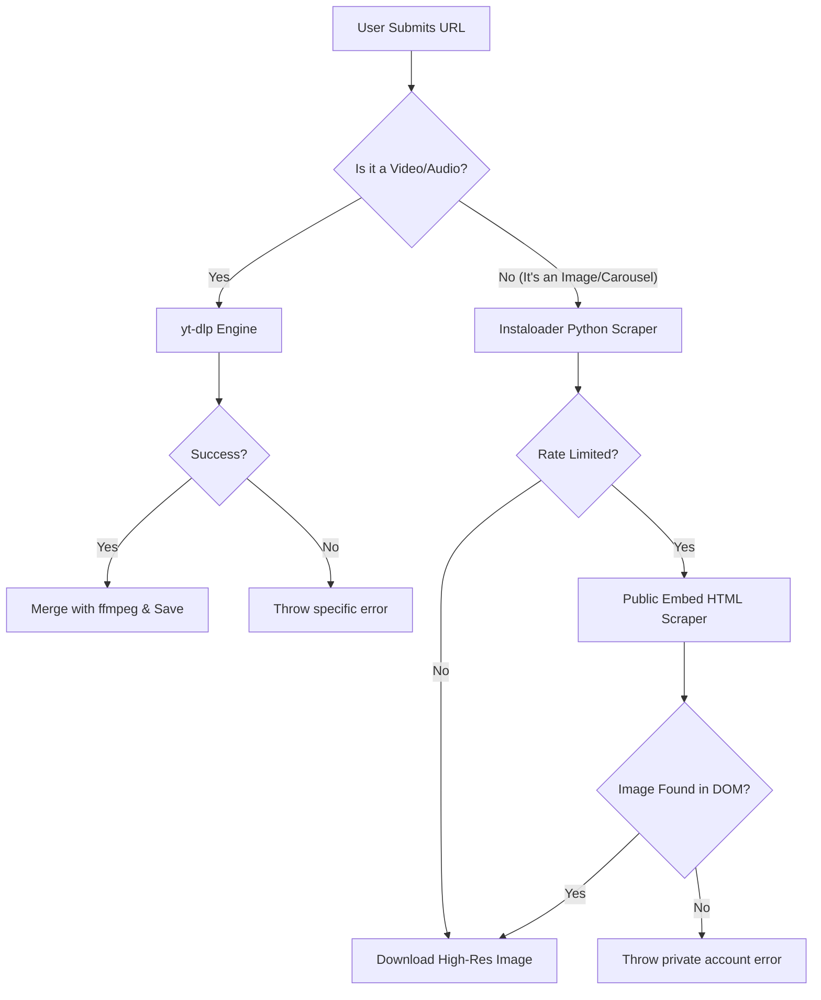

<div align="center">
  
</div>

# Ultimate Media Downloader

A modern, high-performance web application that allows you to easily download media from **YouTube**, **Instagram**, and **TikTok**. Built with Next.js, React, and `yt-dlp`, this application features a beautiful UI, a background download queue, and a persistent media library.

## ✨ Features

- **Multi-Platform Support:** Download videos, audio, and images from YouTube, Instagram (Posts & Reels), and TikTok.
- **Background Queue System:** Don't wait for large files! Add videos to the queue and let the server download them in the background. You can track progress in real-time.
- **Media Library:** All your downloaded files are saved to the server and organized in a beautiful Library gallery for easy viewing, playing, and redownloading.
- **Best Quality Auto-Merging:** Automatically grabs the absolute highest quality video available (up to 4K) and merges it with the best audio track using `ffmpeg`.
- **Beautiful Modern UI:** Glassmorphism-inspired aesthetic with dark mode and smooth micro-animations.

---

## 🚀 Getting Started & Setup Guide

### 1. Prerequisites
Make sure you have [Node.js](https://nodejs.org/) installed on your machine.
You must also have **Python (3.7+)** installed on your system to use the advanced Instagram image scraper.

### 2. Installation
Clone this repository to your local machine:
```bash
git clone https://github.com/Subhan-Haider/Media-Downloader.git
cd Media-Downloader
```

Then, install the required Node and Python dependencies:
```bash
npm install
pip install instaloader
```

### 3. Running the App
Start the development server:
```bash
npm run dev
```
Open [http://localhost:3000](http://localhost:3000) in your browser to start downloading!

---

## 🌍 Deployment & Advanced Server Usage

If you want to run this application permanently on a Linux server (like an Ubuntu VPS) or run it on a different port, follow these steps:

### Running Continuously with PM2
To keep the app running in the background even after you close your SSH terminal, use `pm2`.

1. Install PM2 globally:
   ```bash
   npm install -g pm2
   ```
2. Build the app for production:
   ```bash
   npm run build
   ```
3. Start the app with PM2:
   ```bash
   pm2 start npm --name "media-downloader" -- run start
   ```
4. Configure PM2 to start on server boot:
   ```bash
   pm2 startup
   pm2 save
   ```

### Changing the Port
By default, Next.js runs on port `3000`. If you want to change the port (e.g., to port `8080`), you can pass the port flag when starting the app:

**For Development:**
```bash
npm run dev -- -p 8080
```

**For Production / PM2:**
```bash
# Start directly
npm run start -- -p 8080

# Or start with PM2
pm2 start npm --name "media-downloader" -- run start -- -p 8080
```

### 🎨 Rebranding Tool (Customizer)
Want to change the app name, description, or GitHub links to your own? We've included a standalone Windows graphical tool that automatically finds and replaces branding strings across the entire project safely!

<a href="https://apps.microsoft.com/detail/9P3HKF1XTMW2?hl=en&gl=CA&ocid=pdpshare">
  
</a>

1. Download or locate `RebrandTool.exe` in the root of the repository.
2. Double-click the `.exe` file to open the modern UI.
3. Enter your old values (pre-filled with defaults) and your new values.
4. Select optional Image Assets to replace the logo and favicon (automatically converts images to `.png`!)
5. Click **Start Rebranding**.

---

## 📂 Project Structure

- `src/app/page.tsx` - The main downloader interface.
- `src/app/queue/page.tsx` - The background download queue monitor.
- `src/app/library/page.tsx` - Your personal gallery of downloaded media.
- `src/app/api/queue/route.ts` - The backend engine handling yt-dlp, format selection, and ffmpeg merging.
- `data/` - Secure storage for the `db.json` database and the `/library/` where all downloaded media is saved.

## 🛠️ Technology Stack
- **Frontend:** Next.js (App Router), React 19, Lucide React Icons
- **Backend:** Node.js, Next.js API Routes, Local JSON Database
- **Extraction & Merging:** `youtube-dl-exec` (yt-dlp interface), `ffmpeg-static`, `instaloader` (Python)

---

## 🧠 How It Works (The Tri-Layer Extraction Engine)

The backend uses a smart routing system to ensure your media is downloaded flawlessly. When you submit a URL, it goes through a multi-stage fallback process:



---

## ⚖️ Disclaimer

**Educational Purposes Only.** This application is designed as a personal utility for downloading publicly available, non-copyrighted content or content you hold the rights to. 
- You are solely responsible for ensuring that you do not violate the terms of service of YouTube, Instagram, or TikTok.
- Do not use this tool to download copyrighted material without the explicit permission of the creator.
- The developers of this tool are not responsible for any misuse, account bans, or copyright infringements caused by the user.

---

## 🤝 Contributing
Contributions, issues, and feature requests are welcome! 
Feel free to check out the [issues page](https://github.com/Subhan-Haider/Media-Downloader/issues) if you want to contribute.
